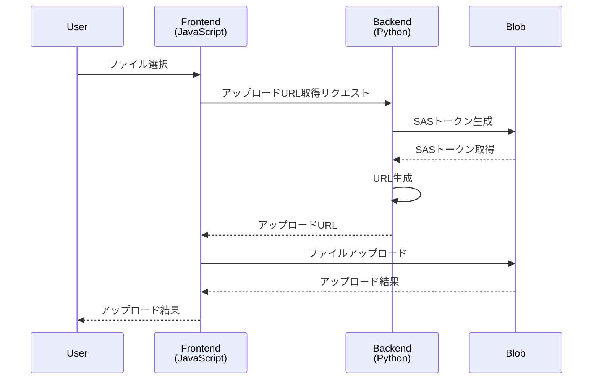

# 概要
AzureのBlobストレージへファイルアップロードをするためのサンプルプログラムの紹介です。
Backend(Python)でShared Access Signature (SAS) を生成して、ストレージへの制限付きアクセスを許可するURLを発行します。
そのURLを使用してFrontend(JavaScript)からファイルをアップロードします。

今回作成したサンプルコードはこちらです。
https://github.com/horitaka/azure-blob-sample


以下のSDKを使用しています。
- [azure-storage-blob](https://pypi.org/project/azure-storage-blob/) (12.19.1): BackendでのSASトークンの発行
- [@azure/storage-blob](https://www.npmjs.com/package/@azure/storage-blob) (12.17.0): FrontendからBlobストレージへのファイルアップロード

# 構成
SASの発行はBackendで行い、ファイルアップロードはFrontendからBlobストレージに直接アップロードする構成です。




# サンプル

## Backend

### 1. ロール割当

Backendプログラムに対して、SASトークン発行とBlobストレージへの書き込み権限を付与します。

最初に、カスタムロールを作成します。

```bash
az role definition create --role-definition role.json
```

```json:role.json
{
  "Name": "Blob test developer",
  "IsCustom": true,
  "Description": "Blob test developer",
  "Actions": [
    "Microsoft.Storage/storageAccounts/blobServices/generateUserDelegationKey/action"
  ],
  "DataActions": [
    "Microsoft.Storage/storageAccounts/blobServices/containers/blobs/*"
  ],
  "AssignableScopes": [
    "/subscriptions/{subscriptionId}/resourceGroups/{resourceGroupName}"
  ]
}
```

作成したロールを割り当てます。
今回はローカルから実行するため、ローカル環境でログインをしているアカウントに対して、ロールを割り当てます。

```
az ad signed-in-user show --query id -o tsv     
```

```bash
az role assignment create --assignee "{assignee}" --role "{roleNameOrId}" --scope "/subscriptions/{subscriptionId}/resourceGroups/{resourceGroupName}"
```


**参考情報**
- [Azure CLI を使用して Azure カスタム ロールを作成または更新する](https://learn.microsoft.com/ja-jp/azure/role-based-access-control/custom-roles-cli)
- [Azure CLI を使用して Azure ロールを割り当てる](https://learn.microsoft.com/ja-jp/azure/role-based-access-control/role-assignments-cli)


### 2.SASの生成

次に、SASを作成するプログラムを紹介します。

Blobを操作するためのSDKとしてazure-storage-blobをインストールします。また、Entra ID (旧Azure Active Directory)での認証をサポートするazure-identityをインストールします。

```
pip install azure-storage-blob azure-identity
```

認証情報を利用して、BlobServiceClientを作成します。

```py
account_url = "https://<storage-account-name>.blob.core.windows.net"
blob_service_client = BlobServiceClient(account_url, credential=DefaultAzureCredential())
```

SASトークンに署名するためのユーザー委任キーを作成します。

```py
def request_user_delegation_key(self, blob_service_client: BlobServiceClient) -> UserDelegationKey:
    delegation_key_start_time = datetime.datetime.now(datetime.timezone.utc)
    delegation_key_expiry_time = delegation_key_start_time + datetime.timedelta(days=1)

    user_delegation_key = blob_service_client.get_user_delegation_key(
        key_start_time=delegation_key_start_time,
        key_expiry_time=delegation_key_expiry_time
    )

    return user_delegation_key
```


ユーザー委任キーを使用して、SASトークン(ユーザー委任SAS)を作成します。

```py
def create_user_delegation_sas_blob(self, blob_client: BlobClient, user_delegation_key: UserDelegationKey):
    start_time = datetime.datetime.now(datetime.timezone.utc)
    expiry_time = start_time + datetime.timedelta(days=1)

    sas_token = generate_blob_sas(
        account_name=blob_client.account_name,
        container_name=blob_client.container_name,
        blob_name=blob_client.blob_name,
        user_delegation_key=user_delegation_key,
        permission=BlobSasPermissions(read=True),
        expiry=expiry_time,
        start=start_time
    )

    return sas_token

```

生成されたSASを使用して、ファイルアップロード用のURLを組み立てます。

```py
sas_url = f"{blob_client.url}?{sas_token}"
```

**参考情報**
- [Python を使用して BLOB のサービス SAS を作成する](https://learn.microsoft.com/ja-jp/azure/storage/blobs/sas-service-create-python)


## Frontend

### 1.ファイルアップロード

Blobストレージを操作するためのJavaScript用のSDKをインストールします。

```bash
npm install @azure/storage-blob
```

先ほど作成したBackendプログラムから、SASトークン付きのファイルアップロードURLを取得します

```ts
const handleUpload = async () => {
  const apiUrl = process.env.NEXT_PUBLIC_API_URL as string;
  const response = await fetch(apiUrl, { method: "POST" });
  const url = (await response.json()).url;
};
```

JavaScript用のSDKに先ほど取得したURLを渡して、Blobストレージにファイルをアップロードします。

```ts
import { BlockBlobClient } from "@azure/storage-blob";
・・・
const handleUpload = async () => {
  const apiUrl = process.env.NEXT_PUBLIC_API_URL as string;
  const response = await fetch(apiUrl, { method: "POST" });
  const url = (await response.json()).url;
  const client = new BlockBlobClient(url);
  await client.uploadData(file);
};
```

アップロードを実行するbuttonとinputを作成します。
```ts
return (
  <div>
    <input type="file" onChange={handleFileSelect} />
    <button onClick={handleUpload}>Upload</button>
  </div>
);
```


**参考情報**
- [クイック スタート:ブラウザーで JavaScript v12 SDK を使用して BLOB を管理する](https://learn.microsoft.com/ja-jp/azure/storage/blobs/quickstart-blobs-javascript-browser)


## 動作チェック

画面からファイルを選択してアップロードすることで、Blobへのアップロードができました。